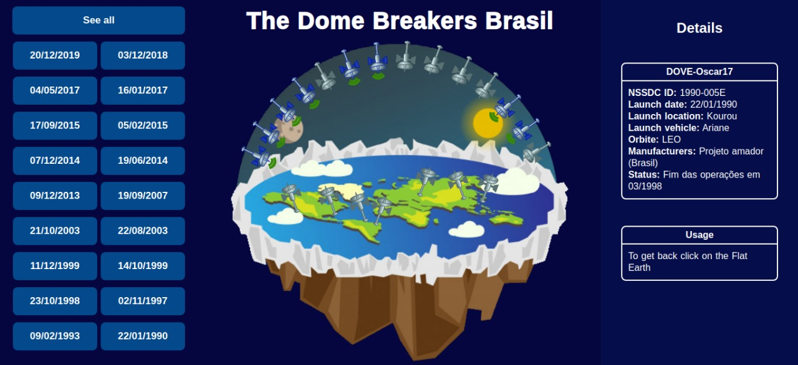

# Dome Breakers
### On the flat Earth, satellites do not go into orbit, get stuck in the dome. They, are the __Dome Breakers__.

This project is an animated sample of the cataloged Brazilian satellite launches, and their status of operation since the first mission [DOVE-Oscar17](https://en.wikipedia.org/wiki/Dove-OSCAR_17) back in 90's until the last update available by the Brazilian government in their program of [Open Data](https://dados.gov.br/dataset/objetos-espaciais-brasileiro) about spatial objects.

To see the project working, check out the [production version](https://dome-breakers.vercel.app/) deployed at [Vercel](https://vercel.com/).